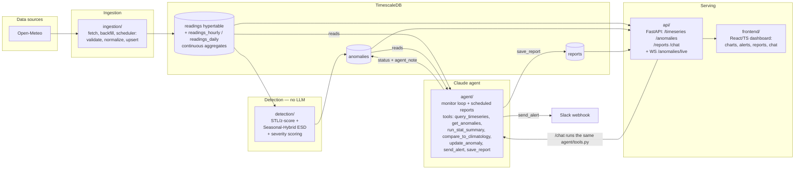
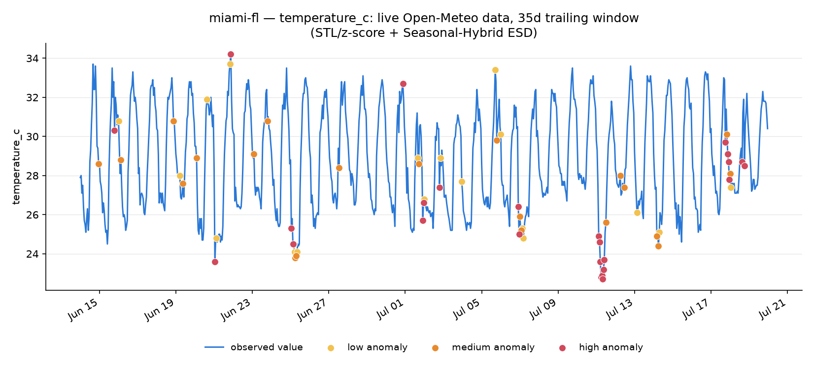

# Weather Anomaly Agent

Live weather readings flow in, two independent statistical detectors flag
what looks abnormal, and a Claude-powered agent reads those flags to explain
*why* they matter and alert on the ones that do — all surfaced through an
API and a dashboard.

**Why this split matters:** anomaly detection is deterministic/statistical
(no LLM in the loop), and the agent only interprets and narrates anomalies
the engine already flagged rather than detecting them itself. That keeps
"is this actually unusual?" auditable and reproducible, while still getting
natural-language explanations, prioritized alerts, and daily/weekly reports
out of the same flagged data.

## How the pieces fit together



Detection is the only path that creates anomalies, and it uses no AI model at
all — you can fetch real data, flag anomalies, and inspect them purely with
statistics. The agent never detects; it reads flagged anomalies (plus the raw
readings behind them, for grounding) and writes back only interpretation:
a status and note on the anomaly, a saved report, and a Slack alert. The API
reads all three tables straight from the database rather than from the agent —
the two never call each other, except that `/chat` runs the agent's own tools
in-process to answer questions live.

## Detection in action (real data)

The chart below is **not synthetic** — it's Open-Meteo temperature data for
Miami, FL over a real trailing 35-day window, run through both detectors
exactly as `detection/run.py` would (via `notebooks/live_demo.ipynb`). Markers
are genuine flagged points, colored by the severity the engine assigned:



- **STL/z-score** (`detection/stl_zscore.py`) decomposes the series into
  trend + daily-seasonal + residual, then flags points whose residual clears
  a robust (MAD-based) z-score threshold.
- **Seasonal-Hybrid ESD** (`detection/seasonal_esd.py`) deseasonalizes and
  runs a Generalized ESD test, bounding how many points it can flag so it
  stays conservative even when several anomalies co-occur.

Both write to the same `anomalies` table so their outputs are directly
comparable rather than one replacing the other — see `detection/README.md`
for the full method writeup, thresholds, and a backtest against the real
2021 Pacific Northwest heat dome.

## Getting started

```bash
cp .env.example .env   # fill in ANTHROPIC_API_KEY etc.
cd infra
docker compose up -d db
```

`schema.sql` is meant to auto-apply via `docker-entrypoint-initdb.d` on first
boot, but on some TimescaleDB image builds the extension-install step
restarts Postgres mid-init and the remaining init scripts don't run. If
`psql "$DATABASE_URL" -c '\dt'` shows no tables after the container is up,
apply it manually once:

```bash
psql "$DATABASE_URL" -f infra/schema.sql
```

Then, from the repo root, each component's own README has full instructions
(`ingestion/`, `detection/`, `agent/`, `api/`, `frontend/`). End-to-end order:

```bash
pip install -r ingestion/requirements.txt -r detection/requirements.txt -r agent/requirements.txt -r api/requirements.txt
python -m ingestion.backfill        # historical data for climatology baselines
python -m ingestion.fetch           # current/recent data
python -m detection.run             # (run from detection/) flag anomalies
python -m agent.monitor             # investigate new anomalies, draft alerts
uvicorn api.main:app --reload       # API on :8000
cd frontend && npm install && npm run dev   # dashboard on :5173
```

This whole path has been run end-to-end against real Open-Meteo data during
development, including the anomaly detection engine, the FastAPI layer, and
the frontend build — everything except the live `/chat` → Claude API call,
which needs a real `ANTHROPIC_API_KEY`.

## Live demo notebook

`notebooks/live_demo.ipynb` runs the core pipeline against **real, live
weather data** with no Docker/TimescaleDB/API/frontend needed: it fetches
current Open-Meteo readings, runs both anomaly detectors in-memory, plots
the results (including a side-by-side comparison of how much STL/z-score
and Seasonal-Hybrid ESD actually agree), and — if `ANTHROPIC_API_KEY` is
set — has Claude narrate the flagged anomalies. It's pre-executed; to
regenerate with a fresh live pull:

```bash
pip install -r ingestion/requirements.txt -r detection/requirements.txt -r agent/requirements.txt jupyter nbconvert
python scripts/make_live_demo_notebook.py
cd notebooks && jupyter nbconvert --to notebook --execute --inplace live_demo.ipynb
```

The `images/anomaly_detection_example.png` chart above was generated the
same way: real Open-Meteo data through the same `detection/` functions, no
Docker or database required.
